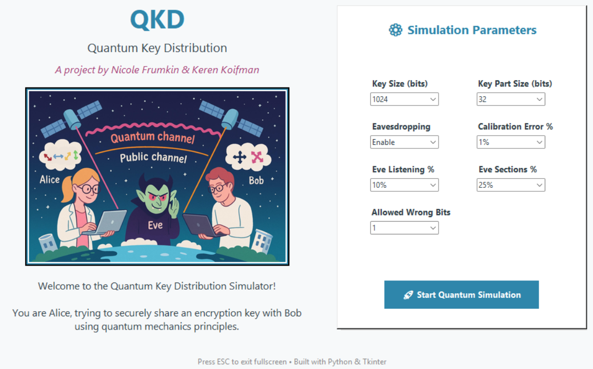

<p align="center">
  
</p>


# 🔐 Quantum Key Distribution (QKD) Simulator

This project demonstrates the principles of **Quantum Key Distribution (QKD)** using a visual Python interface and a C-based backend for the simulation. It shows how Alice and Bob can securely exchange a secret key - even with an eavesdropper (Eve) listening in.

---

## 🖥 GUI Overview

Welcome screen of the simulator:



---

## ⚙️ Configuration Parameters

You can configure:
- 🔢 Key size (e.g., 1024 bits)
- 🧩 Section size (e.g., 32 bits)
- 🕵️‍♀️ Eve’s interference (enabled/disabled)
- ⚠️ Calibration error %
- 📊 Eve’s reproduction % and attacked sections
- ❌ Allowed wrong bits per section

---

## 🔄 How It Works

1. Alice creates a random bit string and encodes it in quantum states.
2. Bob randomly selects measurement bases and attempts to read the bits.
3. Eve may interfere with a subset of photons.
4. Alice and Bob compare measurement bases.
5. Correct bits are sifted and distilled into a key.
6. Sections with too many errors are regenerated.
7. The process continues until the full key is created.

---

## 🧠 Symbol Legend

The legend below shows the symbols and their meanings used in the simulation output:

 <!-- You may want to crop/replace this with a cleaner 'legend-only' image if desired -->

---

## 🧪 Example Section Output

Each simulation shows detailed section-wise data, including polarization, measurements, Eve's impact, and key distillation:


---

## 🔑 Final Key

Once enough valid sections are collected, the simulator builds the final secret key:


---

## 📈 Summary of Results

At the end of the simulation, a summary is shown with detailed statistics:


---

## 🚀 How to Run

### 🐍 Python GUI
Make sure you have Python and dependencies (`tkinter`, `Pillow`) installed.

```bash
python qkd_gui.py
````

### 💻 Compile & Run C Simulator (optional)

The simulator backend is written in C for performance.

```bash
gcc main.c -o main.exe
./main.exe -k1024 -ps32 -e -ec1 -ee50 -ep25 -es10 -a1
```

---

## 🧑‍💻 Authors

* Nicole Frumkin
* Keren Koifman

---

## 🎯 Project Goal

This simulator was built as an educational tool to demonstrate how quantum mechanics can enable secure communication using QKD. It's interactive, visual, and accessible—even if you're new to quantum concepts.

---

## 📌 Notes

* Press `ESC` to exit fullscreen in the GUI.
* Built with Python 3, Tkinter, and C.
* Tested on Windows.

---

Feel free to experiment with the parameters and observe how Eve’s attack affects the final key 🔐
